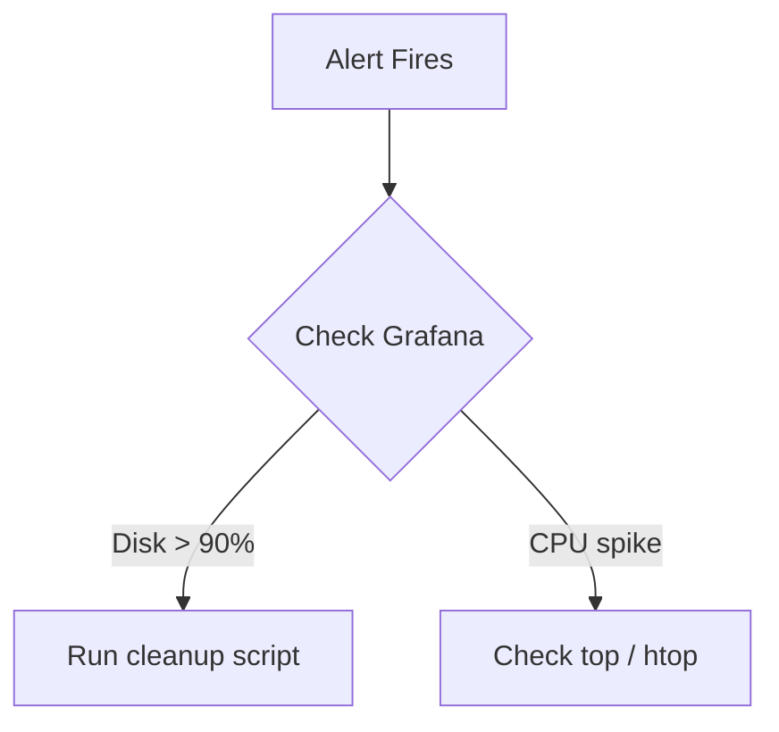

# How I Built This Knowledge Base — From Zero to Live

This article documents the exact process I followed to build and deploy this site — a free, fast, globally distributed technical knowledge base. If you want to build something similar, this is your blueprint.

**Total cost: $0/month.**

---

## The Goal

I wanted a place to document everything I learn on the job — troubleshooting guides, runbooks, commands, architecture notes, and lessons learned. The requirements were:

- Write in Markdown, nothing complex
- Fast globally, mobile friendly
- Free to host
- Easy to update — just push and it's live
- Built-in search
- Professional look with dark mode, code blocks, copy buttons
- Good SEO so other engineers can find it

---

## The Stack

| Component | Tool | Cost |
|---|---|---|
| Framework | MkDocs Material | Free |
| Hosting | Cloudflare Pages | Free |
| CDN + SSL | Cloudflare (built-in) | Free |
| Search | MkDocs built-in | Free |
| Source control | GitHub | Free |
| Domain | Your own domain via Cloudflare DNS | Free if you don't care about TLD |

---

## Why MkDocs Material

I evaluated several options — Hugo, Docusaurus, Astro, Next.js static export, and GitHub Pages. MkDocs Material won because:

- It is designed specifically for technical documentation
- Built-in full-text search with no third-party service needed
- Dark mode, code copy buttons, syntax highlighting, admonition blocks — all out of the box
- Navigation is auto-generated from your folder structure
- You never touch anything except Markdown files once set up
- Builds in under 60 seconds on Cloudflare Pages

---

## Prerequisites

- A Mac or Linux machine with Python 3 installed
- A GitHub account
- A Cloudflare account (free)
- A domain with DNS managed through Cloudflare

---

## Step 1 — Install MkDocs Material

Open Terminal and install the framework:

```bash
python3 --version        # confirm Python is installed
pip3 install mkdocs-material
```

---

## Step 2 — Create the Project

```bash
# Create and navigate into your project folder
mkdir my-knowledge-site
cd my-knowledge-site

# Initialize MkDocs
mkdocs new .
```

This creates two things:

```
my-knowledge-site/
├── mkdocs.yml       ← site configuration
└── docs/
    └── index.md     ← your home page
```

---

## Step 3 — Configure mkdocs.yml

Replace the default contents of `mkdocs.yml` with a full configuration. Open it:

```bash
vim mkdocs.yml
```

Paste in your configuration. The key sections are:

```yaml
site_name: Your Name | Tech Knowledge Base
site_url: https://yourdomain.com
site_description: Infrastructure and platform engineering guides, runbooks, and troubleshooting references.

theme:
  name: material
  palette:
    - media: "(prefers-color-scheme: dark)"
      scheme: slate
      primary: teal
      accent: cyan
      toggle:
        icon: material/brightness-4
        name: Switch to light mode
    - media: "(prefers-color-scheme: light)"
      scheme: default
      primary: teal
      accent: cyan
      toggle:
        icon: material/brightness-7
        name: Switch to dark mode
  font:
    text: IBM Plex Sans
    code: JetBrains Mono
  features:
    - navigation.tabs
    - navigation.sections
    - navigation.top
    - navigation.indexes
    - toc.integrate
    - search.suggest
    - search.highlight
    - search.share
    - content.code.copy
    - content.code.annotate
    - content.tooltips

plugins:
  - search:
      lang: en

markdown_extensions:
  - pymdownx.highlight:
      anchor_linenums: true
  - pymdownx.superfences:
      custom_fences:
        - name: mermaid
          class: mermaid
          format: !!python/name:pymdownx.superfences.fence_code_format
  - pymdownx.tabbed:
      alternate_style: true
  - pymdownx.tasklist:
      custom_checkbox: true
  - admonition
  - pymdownx.details
  - attr_list
  - def_list
  - tables
  - toc:
      permalink: true

extra:
  social:
    - icon: fontawesome/brands/github
      link: https://github.com/yourusername

copyright: Copyright &copy; 2024 Your Name
```

!!! tip "No `nav:` block needed"
    Do not add a `nav:` section. Without it, MkDocs automatically generates your navigation from your folder structure. Every new file you drop into a folder instantly appears in the menu — no config changes required.

---

## Step 4 — Build Your Folder Structure

Organise your content into logical sections. My structure:

```bash
mkdir -p docs/kb/{azure,cloudflare,devops,linux,networking,security,monitoring,automation}
mkdir -p docs/{troubleshooting,runbooks,scripts}
```

Create a placeholder `index.md` in each folder:

```bash
# On Mac using sh (not bash), use this loop syntax:
for dir in azure cloudflare devops linux networking security monitoring automation; do
  echo "# $dir" > docs/kb/$dir/index.md
  echo "" >> docs/kb/$dir/index.md
  echo "Articles and guides for $dir." >> docs/kb/$dir/index.md
done

# Other sections
echo -e "# Troubleshooting\n\nIssue → Cause → Resolution guides." > docs/troubleshooting/index.md
echo -e "# Runbooks\n\nStep-by-step operational runbooks." > docs/runbooks/index.md
echo -e "# Scripts\n\nReusable scripts and automation snippets." > docs/scripts/index.md
echo -e "# About\n\nInfrastructure and platform engineer. This site is my personal technical knowledge base." > docs/about.md
```

!!! warning "Mac shell compatibility"
    On macOS, the default shell used by scripts may be `sh` rather than `bash`. The `${var^}` capitalisation syntax is bash-only and will fail with `bad substitution`. Use plain `echo` commands or run `bash` explicitly.

---

## Step 5 — Add the Requirements File

Cloudflare Pages needs to know which Python packages to install during the build:

```bash
echo "mkdocs-material>=9.5.0" > requirements.txt
```

---

## Step 6 — Preview Locally

```bash
mkdocs serve
```

Open `http://127.0.0.1:8000` in your browser. The site hot-reloads as you save files — you can write and preview in real time.

---

## Step 7 — Push to GitHub

```bash
git init
git add .
git commit -m "init: mkdocs material knowledge base"
git branch -M main
git remote add origin git@github.com:yourusername/your-repo-name.git
git push -u origin main
```

!!! tip "Use SSH not HTTPS"
    If `git push` prompts for a username and password, your remote is set to HTTPS. Switch it to SSH:
    ```bash
    git remote set-url origin git@github.com:yourusername/your-repo-name.git
    ssh -T git@github.com   # test — should greet you by username
    ```
    You need an SSH key added to your GitHub account under Settings → SSH and GPG keys.

---

## Step 8 — Deploy to Cloudflare Pages

1. Go to **Cloudflare Dashboard → Workers & Pages → Create application → Pages**
2. Connect your GitHub account and select your repository
3. Set the build configuration:

| Setting | Value |
|---|---|
| Build command | `pip install -r requirements.txt && mkdocs build` |
| Build output directory | `site` |
| Root directory | *(leave blank)* |

4. Add an environment variable:

| Key | Value |
|---|---|
| `PYTHON_VERSION` | `3.11` |

5. Click **Save and Deploy**

The first build takes about 60–90 seconds. Subsequent builds are typically 30–45 seconds.

---

## Step 9 — Connect Your Custom Domain

0. I created the domain also free from - https://domain.digitalplat.org/ & updated its nameservers to Cloudflare, so that i can manage it from Cloudflare.
1. In Cloudflare Pages → your project → **Custom domains**
2. Click **Add custom domain** and enter your domain (e.g. `yourdomain.com`)
3. Since your DNS is already on Cloudflare, it auto-creates the CNAME record
4. SSL activates automatically — no certificates to manage

Your site is live at `https://yourdomain.com`.

---

## Step 10 — Harden with Security Headers

Create a `_headers` file in your `docs/` folder:

```bash
cat > docs/_headers << 'EOF'
/*
  X-Frame-Options: DENY
  X-Content-Type-Options: nosniff
  Referrer-Policy: strict-origin-when-cross-origin
  X-XSS-Protection: 1; mode=block
  Permissions-Policy: camera=(), microphone=()
EOF
```

Cloudflare Pages serves this file automatically, injecting the headers on every response.

---

## The Publishing Workflow Going Forward

Every time you want to publish a new article:

```bash
# 1. Create your markdown file in the right folder
vim docs/kb/linux/disk-full-troubleshooting.md

# 2. Commit and push
git add .
git commit -m "add: linux disk full troubleshooting guide"
git push
```

That's it. Cloudflare Pages detects the push, builds the site, and deploys it globally in about 45 seconds. No CMS login, no build triggers, no servers to manage.

---

## Article Frontmatter Template

Every article should start with this frontmatter block:

```yaml
---
title: "Descriptive Title — Guide Type"
description: "One or two sentences describing what the article covers. This appears in Google search results."
tags: [technology, topic, type]
---
```

Good title format for SEO:
```
Nginx 502 Bad Gateway — Troubleshooting Guide
Azure Front Door — Origin Health Probe Configuration
Linux Disk Full — Incident Response Runbook
```

---

## Useful MkDocs Content Blocks

These are available out of the box and make articles much more readable.

**Admonition blocks:**

```markdown
!!! tip "Pro Tip"
    Use `ncdu` for an interactive disk explorer on Linux.

!!! warning "Caution"
    Do not run this command on a production node without a backup.

!!! note "Related"
    See also: [SSL Renewal Checklist](/kb/security/ssl-renewal)
```

**Code blocks with copy button and title:**

````markdown
```bash title="Check disk usage"
df -hT
du -sh /var/log/* | sort -rh | head -20
```
````

**Mermaid diagrams inline:**

````markdown

````

---

## Build Limits

Cloudflare Pages free tier gives you 500 build minutes per month. A typical MkDocs build takes under 60 seconds, so you have roughly 500 deployments per month before hitting any limit. For a regularly updated knowledge base this is more than sufficient.

---

## Summary

The entire stack is free, serverless, and requires zero ongoing maintenance. You own the content in plain Markdown files in a Git repository. The site is served from Cloudflare's global edge network with automatic SSL, CDN caching, and DDoS protection included.

The only ongoing task is writing.
