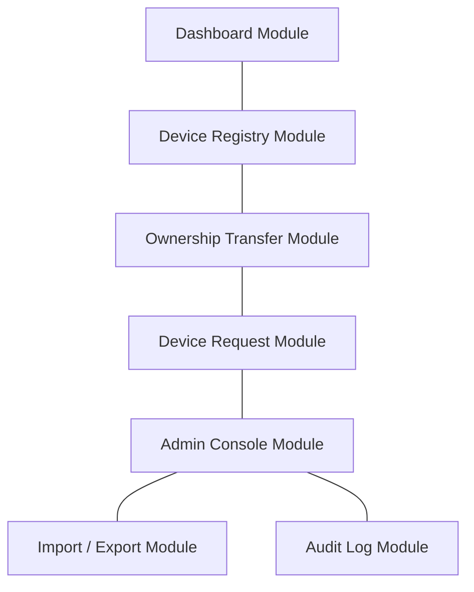
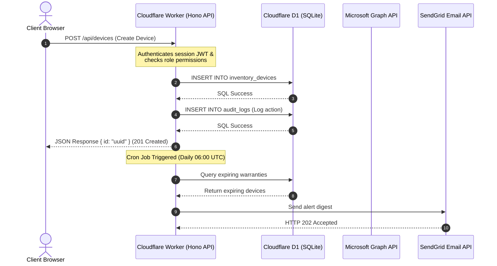

# GeekFavour IT Asset Manager

A modern, enterprise-ready IT asset and hardware lifecycle management solution designed to replace chaotic spreadsheets, static docs, and manual inventory tracking. Run entirely on a serverless edge architecture, **GeekFavour** provides organizations with a secure, real-time, and fully auditable registry of all development, testing, and operational hardware — from laptops and servers to specialized testing equipment.

---

## Table of Contents

- [Overview](#overview)
- [Why Choose This Solution](#why-choose-this-solution)
- [Cost-Effectiveness & Deployment Pricing](#cost-effectiveness--deployment-pricing)
- [Problems It Solves](#problems-it-solves)
- [Key Features](#key-features)
- [Product Modules](#product-modules)
- [Dashboard](#dashboard)
- [Asset & Inventory Management](#asset--inventory-management)
- [User Management](#user-management)
- [Authentication & Security](#authentication--security)
- [Reporting & Insights](#reporting--insights)
- [Import & Export](#import--export)
- [Search & Filtering](#search--filtering)
- [Administration](#administration)
- [Technology Stack](#technology-stack)
- [System Architecture](#system-architecture)
- [Scalability](#scalability)
- [Ideal Customers](#ideal-customers)
- [Frequently Asked Questions](#frequently-asked-questions)
- [Future Enhancements](#future-enhancements)
- [Conclusion](#conclusion)

---

## Overview

In modern enterprises, tracking hardware assets — phones, tablets, RFID readers, laptops, printers, and laboratory test equipment — is notoriously difficult. IT departments frequently rely on static wiki pages, manual Excel lists, or email-based chains. These outdated systems quickly become stale, leading to lost hardware, untracked warranty expirations, security vulnerabilities, and inflated procurement costs.

**GeekFavour** bridges this gap. It is a lightweight, edge-computed Web Application that centralizes asset control. GeekFavour integrates directly with corporate directories (Microsoft Entra ID) to pull authentic employee data, automates hardware requests, and establishes a secure, transparent ownership transfer approval workflow. 

Every asset event is permanently logged. From the moment a device is registered to when it is assigned, updated, repaired, or retired, a tamper-proof audit log records the transition. Running on serverless edge nodes, GeekFavour offers enterprise-grade performance, high reliability, and bank-level security features with zero infrastructure footprint.

---

## Why Choose This Solution

### 🚀 Operational Efficiency
By replacing paper forms and ad-hoc emails with automated workflow modules, GeekFavour shaves off hours of administrative work. Tasks like changing device ownership or requesting replacement laptops are self-serviced by employees and actioned by IT administrators with a single click.

### 📦 Centralized Asset Management
Consolidate hardware categories, network specifications (such as MAC addresses), operating system profiles, and warranty details into a unified database. Dynamic category trees auto-organize the layout, ensuring that IT admins have a single source of truth for the entire hardware inventory.

### 📉 Reduced Manual Effort
Say goodbye to double data-entry and manually checking Excel files for warranty expirations. The automated cron-trigger system scans the inventory database daily, identifying devices with expiring warranties and automatically emailing administrators and custom distribution lists.

### 👁️ Improved Visibility
The executive dashboard gives immediate visibility into total inventory counts, devices currently in repair, hardware categories, manufacturer distributions, top hardware owners, and warranty alerts. Active query parameters in URLs allow users to share pre-filtered lists with other team members in one click.

### 🛡️ Better Compliance
GeekFavour implements database-level immutability constraints. Triggers prevent updates or deletions on audit logs, ownership history tables, and event timelines, giving compliance officers absolute confidence that the ledger represents an accurate historical record of IT operations.

---

## Cost-Effectiveness & Deployment Pricing

One of GeekFavour's most compelling value propositions is its **near-zero hosting cost**. Traditional IT Asset Management (ITAM) software charges a licensing fee per tracked device (typically $2 to $5 per device/month) or a flat user fee that escalates quickly. By leveraging a serverless architecture on Cloudflare, GeekFavour allows you to bypass these massive licensing models.

### Cloudflare Quotas & Consumption

GeekFavour is built to run entirely inside Cloudflare's serverless edge ecosystem. On the **Cloudflare Free/Pro** plan, the daily resource limits are exceptionally generous. 

> [!IMPORTANT]
> Cloudflare provides **100,000 (1 Lakh) API requests per day entirely free**. For a typical IT department managing up to 10,000 hardware devices, daily operational load consumes less than **5% of this free quota**, resulting in a **$0.00 host billing**.

Here is how the infrastructure costs break down for GeekFavour:

| Cloudflare Resource | Serverless Free Allocation | GeekFavour Real-world Usage | Est. Monthly Cost |
| :--- | :--- | :--- | :---: |
| **Workers (API & Routing)** | 100,000 (1 Lakh) requests / day | ~2,000 to 5,000 requests / day | **$0.00** |
| **Pages (Frontend SPA)** | Unlimited Bandwidth | Static React assets (cached globally) | **$0.00** |
| **D1 Database (SQL Registry)** | 5M Reads & 1M Writes / day | ~5,000 Reads & 100 Writes / day | **$0.00** |
| **R2 Storage (Files & Attachments)** | 10 GB Storage / month | ~500 MB (Manuals, templates) | **$0.00** |
| **SendGrid (Mails & Alerts)** | 100 Emails / day | ~10 to 30 Notification emails / day | **$0.00** |
| **Microsoft Graph API** | Unlimited (Included with M365) | Active Directory lookups | **$0.00** |
| **TOTAL MONTHLY HOSTING** | — | — | **$0.00 / month** |

### Return on Investment (ROI) Comparison

If you manage **1,000 active devices** in your organization:
* **Traditional ITAM SaaS:** Costs between **$2,000 and $5,000 per year** in licensing fees.
* **GeekFavour IT Asset Manager:** Costs **$0.00 per year** to host, while offering identical directory integration, single sign-on, and automated approval workflows.

Even if your organization scales dramatically and you transition to Cloudflare's paid Workers tier to accommodate millions of global requests, the flat cost is a nominal **$5.00/month**, which includes 10,000,000 (10 Million) requests free. GeekFavour represents the absolute pinnacle of high-performance, enterprise-grade software engineered at a fraction of standard operating expenses.

---

## Problems It Solves

* **Stale Spreadsheets and Outdated Wiki Pages:** Manual lists drift from reality the moment hardware is moved or re-assigned. GeekFavour keeps inventory live via integrated workflows.
* **Ghost Assets and Device Hoarding:** When employees change roles or leave the company, hardware often gets left in desk drawers. Autocomplete user profiles and the transfer requests queue ensure every device has a validated owner.
* **Sudden Warranty Lapses:** Discovering that a critical testing device is out-of-warranty after it breaks is costly. GeekFavour prevents this with proactive alerts (90, 60, and 30 days before expiration).
* **Unauthorized or Untraceable Changes:** Typical wiki pages let anyone modify records without leaving a trace. GeekFavour restricts access via role-based access control (RBAC), field-level constraints, and an immutable log.
* **Chaotic Bulk Data Migration:** Moving from legacy sheets to a new system is usually error-prone. GeekFavour provides robust CSV validation that flags exact row-level formatting issues without blocking valid records from being imported.

---

## Key Features

| Feature | What It Does | Why It Matters | Business Benefit | User Benefit |
| :--- | :--- | :--- | :--- | :--- |
| **Microsoft Entra ID SSO** | Authenticates users against corporate directories, matching permissions to secure Entra ID groups. | Prevents unauthorized platform access while keeping sign-in effortless. | Reduced identity risks; rapid user onboarding. | One-click corporate sign-in; no separate passwords. |
| **Microsoft Graph Integration** | Fetches user search details, managers, and emails directly from active directory. | Ensures ownership information is accurate and verified (never free text). | Zero orphaned devices; high directory alignment. | Fast autocompleting search for assigning new owners. |
| **Ownership Workflow** | Enforces a dual-sided transfer process requiring the new owner's explicit approval. | Owners must accept responsibility for hardware before the inventory database updates. | Strong accountability; clear custody audit trails. | Clear pending queues; simple approval email links. |
| **Hardware Request Flow** | Allows non-admin users to request new hardware, routing approvals to managers and IT admins. | Streamlines hardware provisioning, justification, and approval in one portal. | Managed procurement budgets; justified hardware usage. | Standardized requests with immediate status updates. |
| **Daily Warranty Monitoring** | Automatically audits device warranties daily and sends email alerts. | Proactively flags expiring assets before they become uncovered liabilities. | Prevent downtime; timely service renewals. | Automated reports; dashboard alert counters. |
| **Field-Level RBAC** | Limits database column updates based on the user's role (Editor vs. Administrator). | Prevents Editors from changing critical hardware serials while letting them add operational notes. | High database integrity; minimized human error. | Editors can update statuses without needing full admin access. |
| **Immutable History Triggers** | Enforces write-once rules on audit logs and device events directly at the database engine level. | Guarantees that historical records cannot be altered or deleted, even by database admins. | Bulletproof security compliance and fraud prevention. | Confidence in historical records during audits. |
| **Row-by-Row CSV Import** | Imports thousands of hardware records, validating format constraints on each line. | Identifies specific cell-level errors while importing all valid hardware rows. | Fast data migration; zero spreadsheet lockups. | Descriptive error table pinpointing CSV syntax issues. |

---

## Product Modules

GeekFavour is partitioned into modular areas, providing clean separation between user operations, management, and system administration:



### 1. Dashboard Module
Provides an executive overview of the hardware inventory. It features live statistics, pie charts showing device categories, and bar charts showing manufacturer distributions. Action items are consolidated into a unified "Pending Approvals Queue."

### 2. Device Registry Module
The core database interface. It supports viewing, searching, and filtering devices. Details are categorized under tabs for General Specifications, Network Configurations (MAC addresses), OS Details, Warranty, Ownership History, and a filterable Activity Timeline.

### 3. Ownership Transfer Module
Coordinates custody updates. Initiating a transfer does not immediately change the database owner. Instead, it places a record in the transfers queue and dispatches an email to the recipient. Only when approved by the recipient does the device state transition to "Assigned."

### 4. Device Request Module
Enables employees to self-service hardware procurement. Requesters input the device type, preferred model, needed-by date, and a business justification. The system queries Microsoft Graph to fetch their manager, sending a notification email to the requester, their manager, and IT administrators.

### 5. Admin Console Module
A restricted console for Administrators. It is split into sub-tabs:
* **Users:** Manage roles (Read Only, Editor, Administrator) and activate or deactivate user accounts.
* **Taxonomy:** Add or edit Manufacturers, Device Types, and Device Categories (supports nested parent-child category relationships).
* **Settings:** Configure warranty notification thresholds (day offsets) and mailing distribution lists.

### 6. Import / Export Module
Handles batch operations. Administrators can download a pre-formatted CSV template, fill in their hardware inventory, and drag-and-drop it for import. Valid devices are created immediately; invalid rows are reported in an error table showing the row number and the exact field validation failure.

### 7. Audit Log Module
A read-only log for compliance officers. It displays every system activity, tracking the user, action type, target entity, timestamp, IP address, user agent, and a detailed JSON view showing the previous and new database values.

---

## Dashboard

The GeekFavour dashboard displays operational statistics, active queues, and distribution charts:

* **Inventory Summary Tiles:** Five distinct tiles display live database aggregates:
  * **Total Devices:** Count of all active devices in the registry.
  * **Assigned:** Hardware assigned to verified employees.
  * **Available:** Hardware in the pool ready for assignment.
  * **In Repair:** Hardware temporarily out-of-service for maintenance.
  * **Retired:** Hardware permanently decommissioned (soft-deleted).
* **Pending Approvals Queue:** Consolidates pending items in one place. If the user is an Administrator, they can review and approve/reject hardware requests directly from the dashboard. If the user is the recipient of a pending device transfer, they can approve or reject ownership here.
* **Device Category Distribution:** A dynamic, color-coded pie chart visualizing the breakdown of hardware across categories.
* **My Devices Panel:** Displays a personalized list of devices assigned to the currently logged-in user, complete with real-time status badges.
* **Top Owners Widget:** Highlights the top 10 employees with the most assigned devices, facilitating inventory auditing and hoarding prevention.
* **Recently Updated Feed:** A rolling log of the last 20 modifications made in the registry.

> [!NOTE]
> All charts and widgets are theme-aware, automatically adapting to light and dark modes.

---

## Asset & Inventory Management

GeekFavour implements a highly structured, data-validated asset model.

```
inventory_devices
 ├── Specifications: Device Name, Manufacturer, Model, Part Number, Serial Number, Asset Tag
 ├── Network Specs: WiFi MAC, Bluetooth MAC, Ethernet MAC
 ├── System Spec: OS Name, OS Version, Firmware Version, Build Number
 ├── Warranty Spec: Start Date, Expiry Date, Provider, Reference ID
 └── Status Fields: Location, Notes, Ownership, soft-deleted indicator
```

### Device Registration & Field Integrity
Registering new devices requires validating unique keys. Both **Serial Number** and **Asset Tag** are governed by unique indexes, preventing duplicate entries. To prevent manual errors, network MAC addresses must match format validation rules (`AA:BB:CC:DD:EE:FF`), and purchase and warranty dates must be in `YYYY-MM-DD` format.

### Device Lifecycle Management
Devices cycle through five key operational statuses:
1. **Available:** Device is sitting in an IT storage location, ready to be assigned.
2. **Assigned:** Assigned to a specific employee verified via active directory.
3. **Repair:** Device is offline for hardware fixes, maintenance, or OS reinstalls.
4. **Retired:** Decommissioned hardware. Deleting a device initiates a soft-delete (`deleted_at`), retaining all historical timelines and logs.
5. **Lost:** Reported missing or unaccounted for.

### Per-Device Timeline & History
Every individual device details page contains two immutable history tabs:
* **Ownership History:** Tracks every hand-off, recording the previous owner, new owner, the administrator who logged the change, the transition timestamp, and any transition notes.
* **Activity Timeline:** Logs fine-grained events. These include OS updates, notes additions, warranty adjustments, reactivation events, and status changes. Each entry records the previous value and the new value.

---

## User Management

User privileges are enforced by role-based access control (RBAC).

### Role Definitions

* **Read Only:** Assigned to all new users by default. Access is restricted to viewing the dashboard, searching the inventory, and requesting hardware.
* **Editor:** Designed for desktop support teams and IT staff. In addition to Read Only privileges, Editors can assign devices to users, process ownership transfers, and edit limited device fields (such as location, notes, and operating system build versions).
* **Administrator:** Full system access. Administrators can create new devices, delete devices, perform batch imports/exports, manage users and roles, customize the taxonomy settings, configure system-wide thresholds, and browse the global audit logs.

### Privilege Matrix

| Operation | Read Only | Editor | Administrator | Enforcing Permission Key |
| :--- | :---: | :---: | :---: | :--- |
| **Search/Filter Devices** | ✅ | ✅ | ✅ | `device.read` |
| **Request Hardware** | ✅ | ✅ | ✅ | *Authenticated session* |
| **Edit Location/Notes/OS** | ❌ | ✅ | ✅ | `device.update` (field-limited) |
| **Edit Core Spec (Serial/Asset Tag/Model)** | ❌ | ❌ | ✅ | `device.update` (all fields) |
| **Assign / Change Owner** | ❌ | ✅ | ✅ | `device.assign` |
| **Unassign / Return to Pool** | ❌ | ❌ | ✅ | `device.assign` + admin role check |
| **Approve / Reject Transfers** | ❌ | ✅ | ✅ | `device.assign` |
| **Approve / Reject Hardware Requests** | ❌ | ❌ | ✅ | Admin role check |
| **Create New Devices** | ❌ | ❌ | ✅ | `device.create` |
| **Delete (Retire) Devices** | ❌ | ❌ | ✅ | `device.delete` |
| **Import CSV Inventory** | ❌ | ❌ | ✅ | `inventory.import` |
| **Export Inventory CSV** | ❌ | ✅ | ✅ | `inventory.export` |
| **Manage Settings & Taxonomies** | ❌ | ❌ | ✅ | `settings.manage` / `category.manage` |
| **Browse Audit Logs** | ❌ | ❌ | ✅ | `audit.read` |

---

## Authentication & Security

GeekFavour is built on a "secure-by-design" methodology, implementing modern, hardened security practices across every layer.

### 🔑 Single Sign-On (Microsoft Entra ID)
GeekFavour uses OAuth 2.0 / OpenID Connect (OIDC) to authenticate corporate users. The login flow verifies authorization tokens and enforces a strict group allowlist (`ENTRA_ALLOWED_GROUPS`). Users who are not member of these groups are denied access.

### 🚨 Break-Glass Local Account
To prevent lockout scenarios when Entra ID is down, the system includes a single local administrator account (`breakglass-admin`).
* The password is encrypted with **PBKDF2-SHA512** using **210,000 iterations**.
* Access is heavily rate-limited (5 attempts per 5 minutes) to protect against brute-force attacks.
* All break-glass login attempts are logged in the immutable audit log.

### 🛡️ Session & API Hardening
* **HttpOnly Session Cookies:** Authentication JWTs are stored in secure cookies (`HttpOnly`, `Secure`, `SameSite=Lax`), preventing XSS token theft.
* **Double-Submit CSRF Protection:** Mutating requests must echo a CSRF token in the `X-CSRF-Token` header. This token is embedded in the signed JWT and captured by the client SPA from the URL fragment on login completion.
* **Field-Level Form Sanitization:** CSV data imports escape common characters (`=`, `+`, `-`, `@`) to protect against Excel Formula Injection attacks.
* **CORS & Headers:** Cross-Origin Resource Sharing (CORS) is pinned strictly to the web application domain. Secure headers like Content Security Policy (CSP), HSTS, `X-Content-Type-Options: nosniff`, and `X-Frame-Options: DENY` are applied to all API endpoints.

---

## Reporting & Insights

GeekFavour generates operational insights through three core reporting mechanisms:

### 1. Daily Warranty Reports
A serverless cron job executes daily, auditing all active hardware warranties. It compares expirations against configured thresholds (e.g., 90, 60, and 30 days before expiration) and sends an automated HTML digest to administrators and distribution lists.

### 2. Live Inventory Data Grids
Using the TanStack Table system, users can sort, filter, and paginate hardware lists. The current table view is mirrored in the URL query string, allowing users to share pre-configured reports (such as "all iOS devices in HQ Storage B") by sharing the URL.

### 3. Change Logging & Audit trails
Administrators can run audit reports filtering logs by action, username, target ID, and date ranges. This log captures the exact IP address, user agent, and changes (values before and after).

---

## Import & Export

### Bulk CSV Import Workflows
Moving legacy spreadsheets into GeekFavour is straightforward. The platform validates each row of the upload file individually.

```
CSV File -> [Format Validation] -> [Serial & Asset Tag Uniqueness Check] -> [Reference Lookup] -> [Record Saved]
                                                                                            └-> Auto-create missing categories, manufacturers, device types
```

> [!TIP]
> Missing taxonomy references (such as a new manufacturer or category name in the CSV) are automatically provisioned in reference tables during import, saving administrators from manual database configuration.

### CSV Export Workflows
GeekFavour supports exporting records in standard CSV format:
* **Full Inventory Export:** Downloads the complete device list, including MAC addresses, operating system data, and warranty details.
* **Filtered List Export:** Clicking "Export" on the devices page honors active search phrases, statuses, categories, or manufacturer filters.
* **History & Timeline Exports:** Download a device's complete ownership history or activity log in one click.

---

## Search & Filtering

GeekFavour features an advanced, multi-field search engine. Users can search and filter the inventory by:

* **Text Search:** A single search input matches device name, model, serial number, asset tag, owner display name, owner email, and MAC addresses using SQL `LIKE` wildcard matching.
* **Taxonomy Filters:** Drill down by specific Manufacturer, Category (includes subcategories), or Device Type.
* **Status Filter:** Select and isolate devices by status (e.g., "Available" vs. "Repair").
* **Owner Filter:** Instantly filter devices assigned to a specific user.
* **OS & Firmware Version Filter:** Filter by specific operating system versions (such as `iOS 18` or `macOS 15`).
* **Warranty Expiry Filters:** Display devices whose warranties are expired, expiring in 30 days, expiring in 60 days, or expiring in 90 days.

---

## Administration

System configurations are managed by administrators via settings panels:

* **Warranty Alerts Thresholds:** A JSON array of day counts (default: `[90,60,30]`) representing the intervals at which warranty alerts are triggered.
* **Distribution List:** A list of target email addresses that receive notifications, in addition to active administrators.
* **Email Toggle:** A master system switch (`email.notifications_enabled`) to enable or disable all outbound email communications.
* **Taxonomy Management:** Fully configurable inputs to add, update, or deactivate reference data categories, device types, and manufacturers. Deactivating a category or manufacturer disables it for future registrations but preserves it on existing assets.

---

## Technology Stack

The GeekFavour application is built using a modern serverless edge architecture:

### Frontend
* **Core Framework:** React 19 (Single Page Application)
* **Build System:** Vite & TypeScript
* **Styling System:** Tailwind CSS with dynamic CSS-variable theming
* **State Management:** TanStack Query (React Query)
* **Data Grids:** TanStack Table (React Table)
* **Charts:** Recharts (responsive category and manufacturer charts)
* **Icons:** Lucide React

### Backend (API Worker)
* **Runtime:** Cloudflare Workers (V8 V8-isolate edge runtime)
* **Web Server Framework:** Hono
* **API Architecture:** RESTful JSON API
* **Cryptography:** PBKDF2-SHA512 (break-glass authentication)
* **Security & JWT:** Hono JWT middleware (`HS256`)

### Databases & Storage
* **Relational Database:** Cloudflare D1 (serverless SQL engine based on SQLite)
* **Object Storage:** Cloudflare R2 (S3-compatible bucket storage for files)
* **Lookup Directory:** Microsoft Graph API (OData-compliant enterprise user search)

### Communications & Operations
* **Notifications System:** SendGrid Web API (email notifications)
* **Cron Auditing:** Cloudflare Workers Cron Triggers (`0 6 * * *` daily check)
* **CI/CD Pipeline:** GitLab CI/CD (lint, test, build, and deploy actions)

---

## System Architecture

The following diagram illustrates how the client browser, serverless edge backend, corporate directory, and external email providers interact:



---

## Scalability

GeekFavour inherits scalability from its serverless edge foundation:

* **Zero-Cold-Start Worker Routing:** Running on Cloudflare Workers, API routes execute inside lightweight V8 isolates with zero cold start delays.
* **Edge SQL Performance:** D1 replicates data at the edge, offering microsecond read latency from any global node.
* **Self-Provisioning Taxonomy:** When importing massive datasets, missing categories, device types, and manufacturers are resolved in-memory and created automatically.
* **Database Index Optimization:** Table indexes are optimized for columns used in query sorting and filtering (`status`, `category_id`, `serial_number`, `warranty_expiry`), ensuring fast search performance even as the database grows to thousands of devices.

---

## Ideal Customers

GeekFavour is designed for organizations that manage hardware inventories, including:

* **Technology & Software Development Companies:** Track development kits, test tablets, reference phones, and team laptops.
* **Logistics & Warehouses:** Track barcode scanners, RFID readers, thermal label printers, and rugged devices.
* **IT Departments:** Centralize hardware provisioning and hand-offs.
* **Educational Institutions:** Monitor classroom laptops, tablets, and laboratory equipment.
* **Healthcare Providers:** Track diagnostic equipment and mobile workstations.

---

## Frequently Asked Questions

### How does the Microsoft Entra ID integration work?
When users access the application, they are redirected to Microsoft's secure login page. Upon successful authentication, Microsoft returns an identity token. GeekFavour verifies this token, checks that the user belongs to allowed security groups, and signs them in. New users are assigned the "Read Only" role by default.

### What is the "break-glass" login account?
The break-glass account is a local administrator profile configured via server secrets. It operates independently of Microsoft Entra ID. If Microsoft services go down, administrators can sign in using this account to manage inventory.

### How does the device transfer approval process work?
To transfer device ownership, an editor or administrator submits a transfer request. This places the request in a "Pending" status and emails the recipient. The recipient can click the approval link in the email or approve the transfer from their dashboard. Once approved, the device status updates to "Assigned" and its owner details are updated.

### Are audit logs tamper-proof?
Yes. Immutability is enforced at the database level using SQLite `BEFORE UPDATE` and `BEFORE DELETE` triggers on audit log, event timeline, and ownership history tables. These triggers block any modification or deletion requests.

---

## Future Enhancements

GeekFavour has a robust foundation, and the architecture supports several future enhancements:

* **Mobile Companion App with Barcode/QR Scanning:** A mobile app to scan serial numbers or asset tags using a phone camera for instant inventory lookups.
* **Barcode and Label Generation:** A utility to print barcodes directly from the device details view.
* **Integration with IT Service Management (ITSM) tools:** Connections to platforms like Jira Service Desk or ServiceNow to link assets with support tickets.
* **Auto-Discovery Agents:** Lightweight endpoint clients to automatically update OS details, build versions, and RAM configurations in the device registry.
* **Manufacturer Warranty API Integrations:** Auto-fetching warranty details directly from manufacturers (such as Apple or Dell) using serial numbers, eliminating manual warranty entries.

---

## Conclusion

GeekFavour IT Asset Manager provides a reliable, secure, and modern alternative to manual asset tracking. By centralizing hardware records, automating requests and transfers, monitoring warranties, and enforcing strict, tamper-proof logs, GeekFavour helps organizations reduce administrative overhead, optimize hardware usage, and improve compliance.

Contact your IT operations team today to deploy GeekFavour and take control of your hardware inventory.
